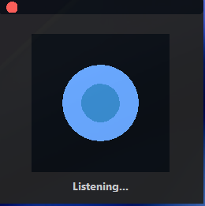

# 🧠 Kayo Voice Assistant UI

A modern animated GUI for a voice assistant built using **CustomTkinter**.  
It features a glowing animated orb that visually represents the assistant's state:

- 🎧 Listening  
- 🤔 Thinking  
- 🗣 Speaking  

This UI acts as the **frontend layer** of an AI voice assistant system.

---

## ✨ Features

- Minimal floating window (always on top)
- Smooth animated orb with glow and ripple effects
- State-based animation:
  - Blue → Listening
  - Purple → Thinking
  - Green → Speaking
- Draggable window
- macOS-style close button
- Dark futuristic theme

---

## 📸 Preview



---

## 🛠 Tech Stack

- Python 3.x  
- customtkinter  
- tkinter  
- math, time  

---

## 📂 File Structure

```bash
Frontend/UI.py   # Main GUI file
```
